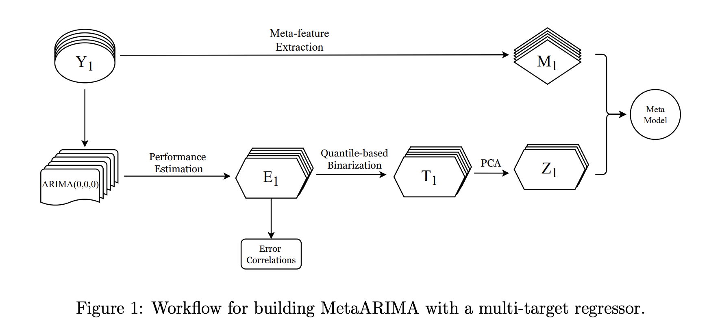

# MetaARIMA - Experiments

This repository contains the experiments for the paper "MetaARIMA: Automatic Configuration of ARIMA using Metalearning" 
(Cerqueira et al., 2025). **MetaARIMA** is a framework for the automatic configuration of ARIMA using metalearning. 
MetaARIMA is built on top of the Nixtla ecosystem.

## MetaARIMA overview

Here's an overview of the workflow behind MetaARIMA.

First, we collect metadata using tsfeatures and 400 ARIMA configurations 
and build a multi-target regression model to learn the relation between
configuration performance and time series features.



Then, for a given time series we use MetaARIMA to select the best configuration


## Getting Started

### Prerequisites

- Python 3.10+
- statsforecast
- catboost
- tsfeatures
- Install dependencies listed in `requirements.txt` using:

```bash
pip install -r requirements.txt
```


### Running Experiments

To reproduce the experiments from the paper:

1. Execute the experimental scripts in the folder scripts/. 

```bash

# Collect metadata and features from time series datasets
python scripts/experiments/collecting_metadata/feature_extraction.py
python scripts/experiments/collecting_metadata/performance_estimates.py
# Train the metamodel
python scripts/experiments/collecting_metadata/train_metaarima.py

# Run metaarima on other datasets, e.g. M3
python scripts/experiments/main/main.py
# Some ablation and sensitivity analyses in scripts/experiments/sensitivity/
python scripts/experiments/sensitivity/ablation.py
```

2. Analyze the results with the scripts on folder scripts/experiments/analysis. For example:
```bash
# Combine the results of different types of methods
python scripts/experiments/analysis/overall_results.py
```


## Citation

If you use this code in your research, please cite:

```bibtex
@article{todo}
```

## Contact

For questions or feedback about this implementation, please open an issue in this repository.
